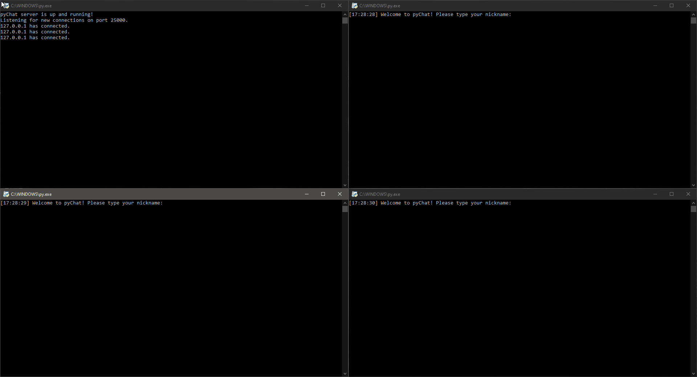
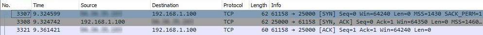
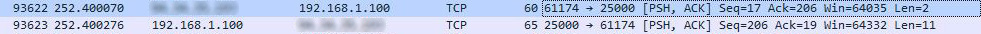
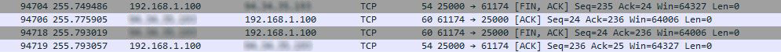
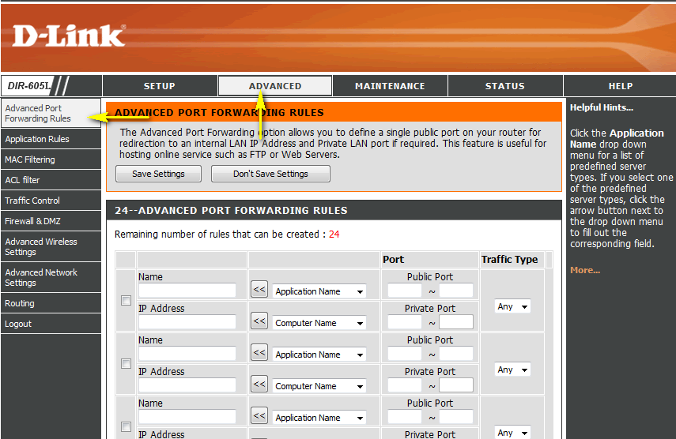

# pyChat
Yet another TCP chat application written in Python

## Introduction
pyChat is a simple TCP multi-client chat application powered by the standard Python socket library.

## Features
 - User commands (`/help`, `/online` and `/quit`)
 - CLI for both server and client application
 - Multiple client support

## Setup
Just clone this repository to your desktop and check if the `colorama` package is already installed, as it is its only one dependency (used for ANSI codes to work on every platform).
If it is not, just run `pip install colorama` and you are ready to go!

## Usage
After you clone this repository to your desktop, go to its root directory and run `pyChat-server.py` to start the server-side application and/or `pyChat-client.py` to start the client-side application.
The server-side application will run on port `25000` by default while the client-side application will try to reach the server on `localhost:25000`.

You can change these as you like by editing the `host` and `port` variables inside both the `.py` scripts.

## Server-side application logic
Since a chat app requires high reliability and the transmission time is relatively less critical, pyChat uses TCP sockets over UDP for the communication and multi-threading for handling multiple clients simultaneously.

The whole code logic for `pyChat-server.py` is pretty much self-explanatory:

 1. [`main()`](https://github.com/Uzarel/pyChat/blob/master/pyChat-server.py#L100) sets up the constants for the socket to be created, creates it, starts a new thread that handles accepting incoming connections and finally closes both clients and server sockets (see [`cleanup()`](https://github.com/Uzarel/pyChat/blob/master/pyChat-server.py#L93)) at termination;
 2. [`connectionThread(sock)`](https://github.com/Uzarel/pyChat/blob/master/pyChat-server.py#L5) always waits and accepts incoming connections, stores their details and for each of them starts a new thread that handles receiving and sending messages;
 3. [`clientThread(client)`](https://github.com/Uzarel/pyChat/blob/master/pyChat-server.py#L17) asks the client for a nickname (see [`getNickname(client)`](https://github.com/Uzarel/pyChat/blob/master/pyChat-server.py#L67)) and stores it, then always waits for upcoming messages and upon reception handles them differently according to their nature:
    - if it is a user command (e.g. `/online`), it handles it in a specific way according to the user command;
    - if it is not a user command, it broadcasts it to all connected users (see [`broadcast(message, sentBy = "")`](https://github.com/Uzarel/pyChat/blob/master/pyChat-server.py#L81)).

## Client-side application logic
The client-side application has a text-based user interface (CLI) and uses multi-threading for handling receiving and sending messages from and to the server simultaneously.

As for `pyChat-server.py`, the whole code logic for `pyChat-client.py` is pretty much self-explanatory:

 1. [`main()`](https://github.com/Uzarel/pyChat/blob/master/pyChat-client.py#L45) sets up the constants for the socket to be created, creates it, connects to the server, starts two new threads that handles receiving and sending messages from and to the server and finally closes the socket at termination;
 2. [`send(sock)`](https://github.com/Uzarel/pyChat/blob/master/pyChat-client.py#L20) always waits for a user prompt, stores it, removes its log from the console to avoid echoing (see [`deleteLastLine()`](https://github.com/Uzarel/pyChat/blob/master/pyChat-client.py#L13)) and then sends it to the server;
 3. [`receive(sock)`](https://github.com/Uzarel/pyChat/blob/master/pyChat-client.py#L31) always waits for upcoming messages from the server and prints them upon reception along with the timestamp (see [`currentTime()`](https://github.com/Uzarel/pyChat/blob/master/pyChat-client.py#L7)).

## Client-server socket logic
The following diagrams show the logic behind the socket API implementation:

1. Sockets setup and connection handling

2. Handling sending and receiving messages between server and client

3. Closing the connection

Diagrams were made with [Mermaid](https://mermaid-js.github.io/mermaid/).

## Debug
The following [Wireshark](https://www.wireshark.org/) logs have been taken on a terminal running `pyChat-server.py` while capturing TCP packets on port `25000` (the default port used by pyChat) to check if the socket side of the application works correctly:

 1. Client connects to the server - A client starts `pyChat-client.py` and establish a connection to the server:

The socket setup works as expected (3-way handshake) since the structure of the packets captured is the following:
     1. SYN (Client ⇒ Server)
     2. SYN-ACK (Server ⇒ Client)
     3. ACK (Client ⇒ Server)
 2. Message broadcasting - A client sends a message to the server and then the server broadcasts it to everyone:
 
 The socket works as expected since the structure of the packets captured is the following:
      1. PSH-ACK (Client ⇒ Server)
      2. PSH-ACK (Server ⇒ Client)
 3. Client disconnects - A client sends a `/quit` message, the server closes the socket on its side and then the client does the same:

The socket teardown also works as expected (4-way handshake) as the structure of the packets captured is the following:
     1. FIN (Server ⇒ Client)
     2. ACK (Client ⇒ Server)
     3. FIN (Client ⇒ Server)
     4. ACK (Server ⇒ Client)

## Troubleshooting
### Port forwarding
In order for the server-side application to work on most networks, you may want to redirect the communication requests from your public address and port number combination to your local address within your LAN and port number combination which represent the pyChat service running on your computer.

This technique (which is a NAT application) goes under the name of **port forwarding** or **port mapping**. For this to take place, you have to setup it on your router:

1.  Login to your router with your credentials;
2.  Navigate to your routers  **port forwarding**/**port mapping**  section;
3.  Create the port forward entries in your router.

## Known bugs

> Whenever a user is writing a message and another message is received by the server, they “overlap”.

Even though the input buffer is still correct and not corrupted, this behavior is weird from a user perspective.
This can be fixed by performing some custom input and output operations using the UNIX-only `curses` library and ANSI escape codes for cursor movement and lines alteration.

**For the time being, I’m not going to fix this.**
